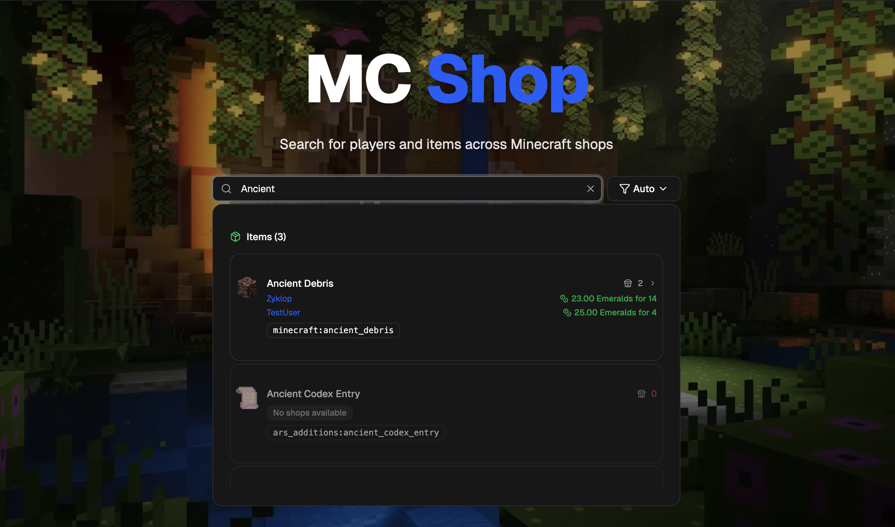
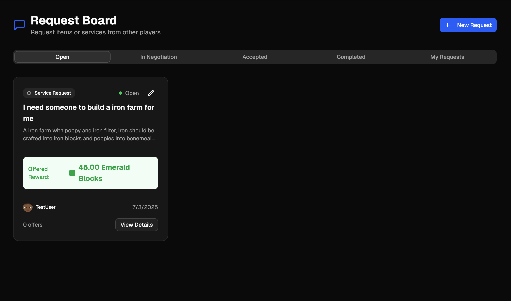
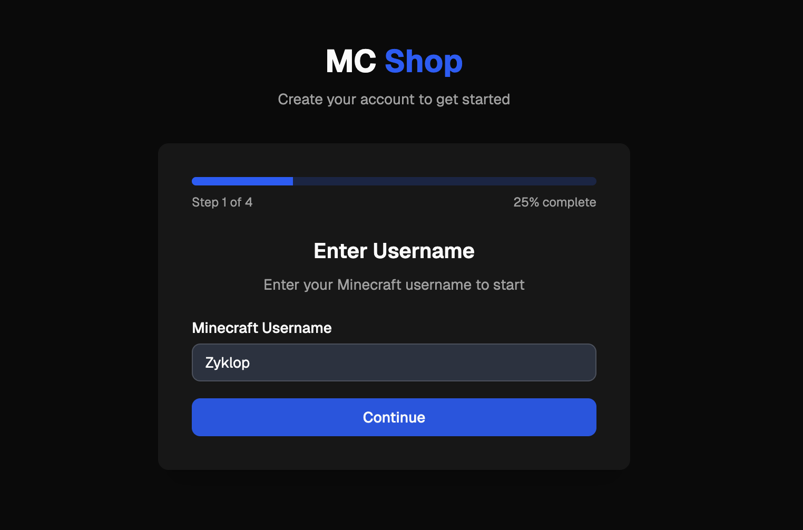
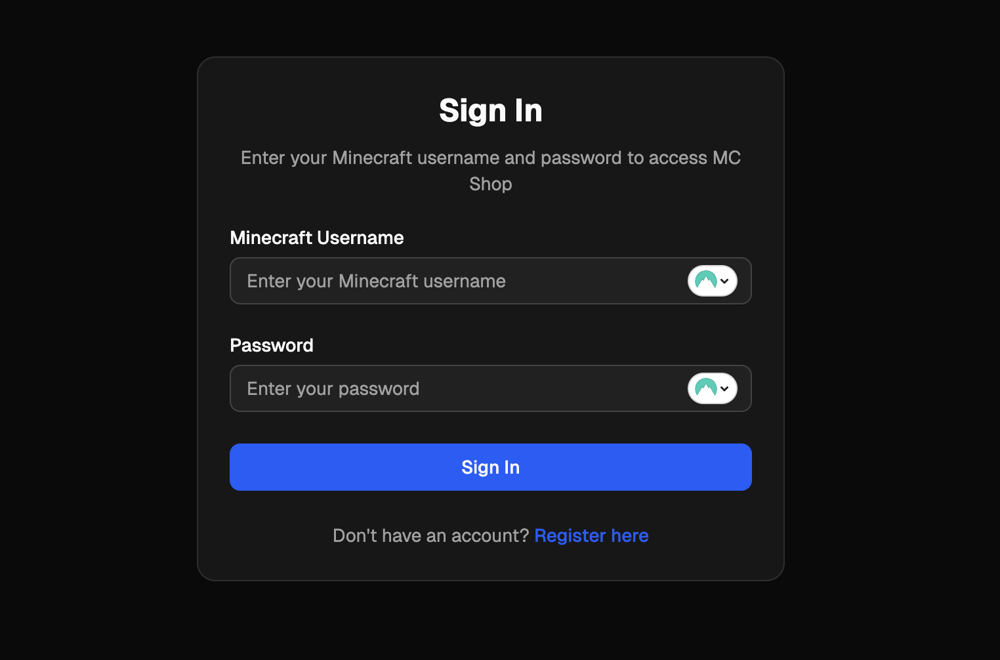

# MC Shop - Minecraft Shop Administration Platform

A comprehensive web application for administrating Minecraft shops through RCON (Remote Console) connection. This platform serves as an administrative interface for managing virtual shops, item requests, and player interactions on a Minecraft server.


_Global search for items and players across all shops_

## 🚀 Features

### 🏪 Shop Management System

- **Create & Manage Shops**: Players can create multiple shops with descriptions and locations
- **Item Inventory**: Add items to shops with pricing, quantities, and availability controls
- **Shop Browsing**: Public shop directory with search and filtering capabilities
- **Location Integration**: Set shop coordinates and generate teleport commands
- **Ownership Controls**: Only shop owners can edit their shops and manage inventory


_Shop management and item listing interface_

### 📦 Item Database & Management

- **Comprehensive Item Database**: 3000+ Minecraft items with English and German names (modded)
- **Item Images**: High-quality item images with fallback support for sphax texture packs
- **Item Search**: Advanced search across item names and IDs in multiple languages
- **Admin Import Tools**: ZIP-based bulk import system with automatic image management
- **Texture Pack Support**: Automatic copying of default textures to Sphax when missing
- **Import Validation**: Real-time validation and progress tracking during import

### 🔍 Global Search System

- **Unified Search**: Single search interface for shops, items, and players
- **Real-time Results**: Debounced search with instant feedback and dropdown results
- **Keyboard Navigation**: Full keyboard support with arrow keys and enter navigation
- **Smart Categorization**: Results grouped by type (players, items, shops)
- **Advanced Filtering**: Filter search results by type and criteria

### 🎯 Request & Offer System

- **Item Requests**: Players can request specific items with suggested prices
- **General Requests**: Request services or non-specific help from other players
- **Offer Management**: Other players can make offers on requests
- **Negotiation Flow**: Accepted offers move to a negotiation phase with messaging
- **Status Tracking**: Complete lifecycle tracking from request to completion
- **Currency Support**: Support for emeralds and emerald blocks as currency


_Request board for item and service requests_

### 🛠️ Admin Item Import System

The platform includes a sophisticated ZIP-based import system for bulk importing Minecraft items:

- **Drag & Drop Interface**: Simply drag your ZIP file or click to browse
- **Automatic Validation**: Real-time file type and size validation (50MB limit)
- **Progress Tracking**: Visual progress bar with detailed status updates
- **Image Management**: Automatic organization and copying of texture files
- **Error Reporting**: Detailed error logs for troubleshooting failed imports
- **Dual Texture Support**: Handles both default and Sphax texture variants

### 🔐 Authentication & User Management

- **Minecraft Integration**: Registration requires being online on the Minecraft server
- **Multi-step Registration**: 4-step process with OTP verification via in-game messaging
- **RCON Verification**: Real-time player verification through server connection
- **UUID Integration**: Automatic player UUID retrieval for profile features
- **Secure Authentication**: Hashed passwords with NextAuth.js integration


_Step 1 of the registration process_


_Sign in with your Minecraft username and password_

### ⚡ RCON Integration

- **Server Communication**: Direct communication with Minecraft server via RCON
- **Player Status Checking**: Real-time verification of online players
- **In-game Messaging**: Send messages and notifications to players
- **Teleport Commands**: Generate clickable teleport commands for shop locations
- **OTP Delivery**: Send verification codes directly to players in-game
- **UUID Retrieval**: Fetch player UUIDs with multiple fallback methods

### 🎨 Modern UI/UX

- **Dark/Light Theme**: Automatic theme switching with system preference and manual toggle
- **Language Support (i18n)**: Full internalization for English and German, with easy language switching
- **ShadCN/UI Components**: Beautiful, accessible component library
- **Responsive Design**: Mobile-first design that works on all devices
- **Mobile Navigation**: Slide-out drawer navigation with Sheet component
- **Horizontal Scrolling**: Mobile-optimized tabs that scroll horizontally
- **Loading States**: Comprehensive loading and error state management
- **Toast Notifications**: User-friendly feedback for all actions

## 🛠️ Installation

Get MC Shop running in minutes with our streamlined installation process.

### Quick Start

```bash
# Clone the repository
git clone <your-repo-url>
cd mc-shop

# Copy environment file
cp .env.example .env

# Start with Docker (recommended)
docker compose up --build
```

The application will be available at `http://localhost:5000`

### 📖 Complete Installation Guide

For detailed installation instructions, environment configuration, troubleshooting, and production deployment:

**➡️ [View Full Installation Guide](INSTALLATION.md)**

The installation guide covers:

- Prerequisites and system requirements
- Docker setup (recommended) vs. local development
- Minecraft server RCON configuration
- Environment variables and security
- Production deployment
- Troubleshooting common issues

## 🔐 User Registration & Admin Setup

### First-Time Setup

The registration process is designed to integrate seamlessly with your Minecraft server:

**🚨 Important: The first user to register becomes the system administrator automatically.**

### Registration Process

1. **Player Must Be Online**: Users can only register while online on your Minecraft server
2. **4-Step Verification Process**:
   - **Step 1**: Enter Minecraft username (verified via RCON)
   - **Step 2**: System generates and sends OTP to player in-game
   - **Step 3**: Player enters verification code from Minecraft chat
   - **Step 4**: Complete registration with secure password

3. **Automatic Admin Assignment**:
   - The **first registered user** automatically receives administrator privileges
   - Admin users gain access to the admin dashboard at `/admin`
   - Subsequent users register as standard players

### Admin Privileges

Administrator users can:

- Access the admin dashboard and management tools
- Import items using the ZIP import system
- Monitor system status and user activity
- View all shops and requests across the platform

## 📚 Usage Guide

### For Players

1. **Getting Started:**
   - Must be online on the Minecraft server to register
   - Complete the 4-step verification process (see Registration section above)
   - First user automatically becomes admin
   - **Choose your language:** Easily switch between English and German at any time
   - **Theme selection:** Toggle between dark and light mode to suit your preference

2. **Creating a Shop:**
   - Navigate to "My Shops" → "Create Shop"
   - Fill in shop details, description, and coordinates
   - Add items with prices and quantities
   - Set shop to active when ready

3. **Making Requests:**
   - Go to "Requests" → "New Request"
   - Choose between item or general service requests
   - Set suggested prices and detailed descriptions
   - Manage incoming offers and negotiate

4. **Browsing & Shopping:**
   - Use the global search to find items or players
   - Browse the shop directory for active shops
   - View item details and available shops

### For Server Administrators

1. **Item Management:**
   - Access the admin dashboard at `/admin`
   - Use the ZIP import system to bulk import items with images
   - Test RCON connectivity at `/test-rcon`
   - Monitor user registrations and shop activity

2. **Admin Dashboard:**
   - Clean, focused interface showing only implemented features
   - Quick access to item import, shop management, and system status

3. **ZIP Import System:**
   - Create a ZIP file with `items.json` and image folders
   - Include `images/default/` for standard textures
   - Optionally include `images/sphax/` for Sphax texture pack
   - System automatically copies default images to Sphax if missing
   - Real-time progress tracking and error reporting
   - Supports PNG images with namespace\_\_item.png naming convention

4. **RCON Features:**
   - Player verification during registration
   - In-game message delivery
   - Teleport command generation
   - UUID resolution for player profiles

## 🏗️ Architecture

### Technology Stack

- **Framework:** Next.js 15 with App Router
- **Database:** PostgreSQL with Prisma ORM
- **Authentication:** NextAuth.js v5
- **UI Components:** ShadCN/UI + Radix UI
- **Styling:** TailwindCSS v4
- **Validation:** Zod schemas
- **RCON:** @minecraft-js/rcon
- **State Management:** React hooks with server actions
- **Type Safety:** Full TypeScript integration
- **Internationalization (i18n):** Built-in support for English and German, with runtime language switching

### Key Architectural Principles

- **Server Actions Only:** No traditional API routes, all backend logic uses Next.js server actions
- **Zod Validation:** All data validation uses Zod schemas for type safety
- **Component-First:** ShadCN UI components for consistent design
- **Custom Hooks:** Modular React hooks for reusable business logic
- **Type Safety:** End-to-end TypeScript from database to UI
- **RCON Integration:** Direct Minecraft server communication for real-time features
- **Responsive Design:** Mobile-first approach with proper navigation patterns

### Project Structure

```
mc-shop/
├── src/
│   ├── app/                    # Next.js app router pages
│   ├── components/             # React components (ShadCN/UI)
│   ├── hooks/                  # Custom React hooks (business logic)
│   ├── lib/                    # Utilities, types, validations
│   ├── server/                 # Server actions, auth, database
│   └── styles/                 # Global CSS and TailwindCSS
├── prisma/                     # Database schema and migrations
├── public/                     # Static assets (item images)
├── docs/                       # Documentation
└── Docker setup files
```

## 🚀 Deployment

For production deployment instructions, environment configuration, and Docker setup details, see the [Installation Guide](INSTALLATION.md).

The installation guide covers production-specific topics including environment security, Docker deployment, and troubleshooting.

## 🤝 Contributing

1. Fork the repository
2. Create a feature branch: `git checkout -b feature/amazing-feature`
3. Make your changes following the existing patterns
4. Run tests and linting: `pnpm check`
5. Commit your changes: `git commit -m 'Add amazing feature'`
6. Push to the branch: `git push origin feature/amazing-feature`
7. Open a Pull Request

### Development Guidelines

- Follow the existing code patterns and architecture
- Use ShadCN components for UI elements
- Validate all data with Zod schemas
- Write server actions for backend logic
- Ensure TypeScript types are properly defined
- Test RCON integrations with the test page

## 📄 License

This project is licensed under the MIT License - see the [LICENSE](LICENSE) file for details.

## 🙏 Acknowledgments

- Built with [T3 Stack](https://create.t3.gg/)
- UI components from [ShadCN/UI](https://ui.shadcn.com/)
- Minecraft RCON integration with [@minecraft-js/rcon](https://www.npmjs.com/package/@minecraft-js/rcon)
- Item images from various Minecraft texture packs

## 📞 Support

- **Installation Help:** See [Installation Guide](INSTALLATION.md) for setup and troubleshooting
- **Documentation:** Check the `/docs` folder for detailed guides
- **Issues:** Report bugs via GitHub Issues
- **RCON Testing:** Use `/test-rcon` page to debug server connections
- **Database:** Use `pnpm db:studio` to inspect data

---

**MC Shop** - Bridging the gap between Minecraft servers and modern web administration tools.
